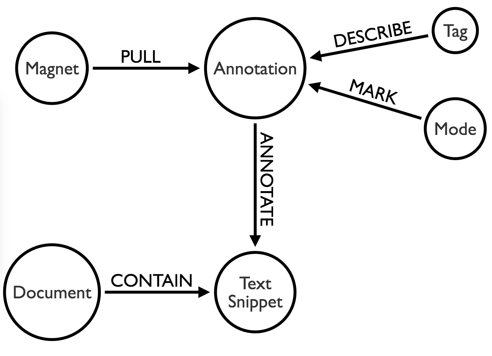
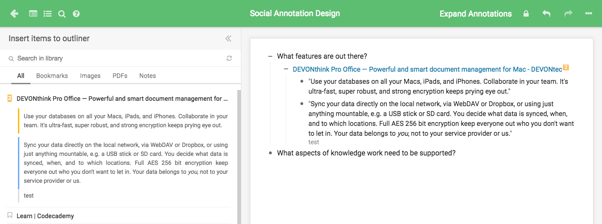

Discow Design: Idea Magnets
===========================

On the H side of Discow, we are not only looking at how *annotations* can support student learning. We are fundamentally concerned with *how knowledge workers interact with information or knowledge*. This is a living document of the design of Discow on this front. Below, we capture key design ideas. At the bottom of this page, we are surveying available systems for (creative) knowledge work, as there is a long list of knowledge management software in this space.

## Conceptual Inspirations

> “An idea is not a single thing. It is more like a swarm.”
> -- Steven Johnson, Where Good Ideas Come From

- [Pull](https://hbr.org/2009/04/four-ways-to-use-serendipity-t.html), (engineered) serendipity, and "structured spikes" (JS Brown)
- Creative cities (Richard Florida)

## Idea Magnets

[Current mockups (pdf)](fig/mockup-v2.pdf)

**What is an Idea Magnet?**

- A larger knowledge structure, which gives annotations a purpose. It is akin to answers to questions like "what this idea is promising for" in earlier promisingness studies.
- Cross-boundary objects: Idea Magnets could serve as *boundary objects* between KF and H. In KF, students may spend significant amount of time to come up with their Idea Magnets---higher level knowledge, wonderments, juicy ideas, inquiry topics, etc. These Idea Magnets are then rendered in H to support *pulling* of promising ideas, promising pieces of information, interesting or surprising information to form a *swarm* around the Idea Magnets. The forming swarms are rendered in KF, with connections drawn among them based on shared annotations and highlights. For example, two Magnets are linked if they share one annotated ideas.

**Who owns an Idea Magnet?**

**How are conceptual artifacts related?**

- An web document: any document living on the web that can be annotated
- A text snippet in the document: tagged using Discow
- An Idea Magnet: that pulls, attracts, subsumes ideas under a larger knowledge structure
- An annotation: that relates the text snippet with the magnet
- An epistemic mode: marking the annotation (problem finding, problem definition, new ideas, etc.)
- A tag: describing the annotation and potentially other annotations as well.

Below is a graph model describing the relations among them.

If idea magnets are pulling together ideas, my current understanding is the original text snippet and the annotation are both seen as ideas.

**Questions**

- Magnets vs. Tags: magnets are emerging, high-level knowledge structures that are tied to student interests. Tags are describers of annotations, which can be about anything. A magnet can be owned by an optimistically formed small group. A same tag can be used across multiple magnets (small groups) to cut across multiple lines of inquiry and to foster cross-group idea sharing / fertilization.

**What does the _Pull_ action really mean? How is it different from _Annotate_?**

> Pull is the ability to draw out people and resources as needed to address the opportunities and challenges of an uncertain world. ...  Pull allows
us to harness and unleash the forces of attraction, influence, and serendipity. ... Pull is about expanding our awareness of what is
possible and evolving new dispositions, mastering
new practices, and taking new actions to realize
those possibilities. It’s about figuring out how to
be systematic in how we combine work and life
to pursue our passions, how to find others who
share our passion but bring different experiences and perspectives to challenging performance
needs, and how to create conditions where we’re
more likely to happen upon interesting people,
resources, and opportunities—even as we contribute
the same chances to others.
>
> Pull works at three primary levels, each of which
builds on the others. At the most basic level, pull
helps us to find and access people and resources
when we need them. At a second level, pull is the
ability to attract people and resources to us that
are relevant and valuable, even if we were not
even aware before that they existed. Think here of
serendipity rather than search. Finally, in a world of mounting pressure and unforeseen opportunities,
we need to cultivate a third level of pull—the
ability to pull from within ourselves the insight and
performance required to more effectively achieve
our potential. We can use pull to learn faster
and translate that learning into rapidly improving
performance, not just for ourselves, but for the
people we connect with—a virtuous cycle that we
can participate in.
> ([Source](https://www2.deloitte.com/us/en/pages/center-for-the-edge/articles/power-of-pull.html))

According to the *Pull* book, three levels of pulls can be briefly described as:

- Access: from stocking knowledge to participating/accessing knowledge flows.
- Attract: foster or engineer serendipity
- Achieve: create knowledge-creation environments that support emergent and self-organizing; "collaboration curve". still vague.

### Organize annotations for knowledge work

- **Tags**: supported by current H. Metadata to make annotations more discoverable.
- **Epistemic mode markers** in an annotation: help students think about the annotated text.
- **Idea Magnets**: larger knowledge structures the annotation is made for. A magnet attracts or pulls annotations. I wish to help students think about an idea as a swarm, so annotations they make get attracted to larger ideas or knowledge structures. They can pretty much drag and drop annotations to magnets, which can be visualized as a group or as a list (in an Outliner). (Before coming up with the name Idea Magnets, I thought about names like Outlines and "Big ideas". Too boring.)

### Review magnets and next-step actions

What's largely missing in existing annotation tools is the lack of support for further work empowered by annotations. Diigo is making progress recently in this regard. It used to be a personal library a user can keep dumping links and annotations into. Now it has an **Outliner** that can be used to organize notes into an outline that can be shared via a URL to someone else. DevonThink allows the user to filter and port notes to a "Smart Group." Also interesting.

But we need stronger support for further actions taken on annotations. The Promising Ideas tool makes sense. But we needs better design. This part is something we need to think deeper in the Discow project, with help from teachers.

- Where should review and reflection take place? In H or KF?
- How to support search and filtering?
- How knowledge gets moved across spaces while maintaining its original context? (We are essentially moving knowledge from a webpage, to H, and potentially to KF or other tools.)

**Review actions in H**

The current mockup (v2) proposes a mechanism to review annotations by magnets. So instead of listing indexing annotations in a page by the locations of annotated text snippets, the review tool organize annotations by magnets.

Moving further, I'd like to think further on ways to show links among all objects -- magnets, annotations, text snippets. It's a swarm. I'd like to see Magnets pulling knowledge objects to the edge, the cutting edge or frontier, while other objects are somehow always connected -- based on their physical, semantic, or epistemic proximity. Below is a visual from a tool for "opinion expression" (close-ended). But I am imagining a similar design concept around *pull* could be used to assist the review of idea magnets.

TODO.

When magnets are reviewed in H, I imagine the user can make edits to the emerging knowledge structure under each magnet. A user can compose a rise-above --- or let's say do a "**pull-up**" --- to synthesize ideas under one magnet and highlight missing parts. This is done in one web document (cf. what KF does).

**Review actions in KF**

What KF can support is reviews of pull-ups from multiple web documents. Here magnets and their pull-ups are further connected with high-level knowledge goals...

TODO.

----

**OLDER THOUGHTS**

After posing these questions earlier, I dwelled on the notion of Idea Magnets a bit. Here are my thoughts now:

- Where should review and reflection take place? In H or KF? --> In KF, where Idea Magnets are rendered.
- How to support search and filtering? --> need to tease out types of knowledge objects in the system -- KF notes, highlights, annotations, replies to annotations, magnets, tags, epistemic markers, etc. Those could be all used for filtering.
- How knowledge gets moved across spaces while maintaining its original context? --> KF generates IMAs --> rendered in H; Web content --> captured by H --> attached to IMAs --> rendered in KF for reflection.

### Design Decisions

**One magnet per post? Or multiple?**

One for now.

**Dropdown menu?**

Maybe a combination of a text input box and a dropdown menu?

**How magnets are displayed in the sidebar?**

See mockup v2.

**Where to store magnets?**

## Design Inspirations

### Promising Ideas tool

Bodong programmed the tool in Knowledge Forum 4 and it's now implemented in KF6 as well. (It needs a refresh.)

### DevonThink (Mac)

- Databases: containing files; independent from each other
- Duplicate vs. Replicate: duplicates are independent; replicates are linked with each other
- Tags
  - Group tags and ordinary tags: [video](https://www.youtube.com/watch?v=di3MlFLMOf4). DevonThink provides interesting ways to add tags, change tags, and make use of tags. The idea of filtering docs by tags and add to a `smart group` is quite interesting and may apply to Discow very well.
- Labels
- Inbox: collecting information into DevonThink (global for all databases); can also be specific to databases
- Highlight notes

### Diigo

- Stripping away social features; keeping personal library and teams
- Outliner: [video](https://www.youtube.com/watch?v=-8yoSzn6Fp8)
  - quite interesting: basically another way to organize knowledge (in addition to tags)
  - drag and drop: 1) links; 2) highlights; to an outline

### [Highlights App](http://highlightsapp.net/) (Mac)

- Export directly to a range of applications

### Swarm Intelligence

- http://unu.ai/
